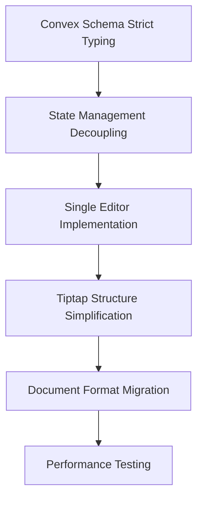

# HyprDoc Comprehensive Refactoring Plan

_Generated: 2025-12-05_
_Based on Architecture Analysis: 2025-12-04_

## Executive Summary

This document provides a detailed, actionable refactoring plan to address all identified architectural issues in HyprDoc. The plan focuses on eliminating technical debt, improving performance, ensuring type safety, and creating a scalable foundation for future development.

## Current Architecture Issues

### 1. Circular Dependencies
- **DocumentContext ↔ EditorCanvas**: Bidirectional state synchronization creates infinite loops
- **TreeManager Integration**: Imported by Context but also used directly by components
- **Performance Impact**: 1-second debounced sync, full tree cloning, hash-based change detection

### 2. Editor per Block Pattern
- **Memory Consumption**: Linear scaling with block count
- **Event Listener Duplication**: Each block creates its own Tiptap editor instance
- **Performance Degradation**: Severe impact on documents with many blocks

### 3. Type Safety Issues
- **7 critical v.any() usages** in Convex schema
- **Loss of compile-time validation**
- **Potential data corruption risks**

### 4. Component Dependency Complexity
- **EditorCanvas depends on Context** for all state management
- **BlockNodeView depends on Editor instance** for storage access
- **EditorBlock components depend on both Context and Editor**

## Refactoring Strategy

### Phase 1: Foundation (Week 1-2) - Critical Infrastructure

#### 1.1 Convex Schema Strict Typing
**Objective**: Replace all `v.any()` with strict schemas

**Implementation**:
```typescript
// Current (vulnerable)
attrs: v.optional(v.any());

// Proposed (type-safe)
attrs: v.optional(
  v.object({
    className: v.optional(v.string()),
    style: v.optional(v.object({
      color: v.optional(v.string()),
      backgroundColor: v.optional(v.string()),
      // Add other common style properties
    })),
    dataAttributes: v.optional(v.record(v.string(), v.string())),
  })
);
```

**Specific Changes**:
1. **Line 40**: `metadata: v.optional(v.any())` → `metadata: v.optional(v.record(v.string(), v.any()))`
2. **Line 50**: `attrs: v.optional(v.any())` → Strict attribute schema
3. **Line 55**: `condition: v.optional(v.any())` → `condition: v.optional(ConditionSchema)`
4. **Line 56**: `children: v.optional(v.any())` → `children: v.optional(v.array(blockSchema))`
5. **Line 66**: `contentJson: v.optional(v.any())` → `contentJson: v.optional(TiptapJsonSchema)`
6. **Line 72**: `terms: v.array(v.any())` → `terms: v.array(TermSchema)`
7. **Line 80**: `snapshot: v.optional(v.any())` → `snapshot: v.optional(DocumentSnapshotSchema)`

#### 1.2 State Management Decoupling
**Objective**: Eliminate circular dependencies

**Implementation**:
```typescript
// New State Management Architecture
┌─────────────────┐    ┌─────────────────┐    ┌─────────────────┐
│   Document      │    │   EditorCanvas  │    │   Convex        │
│   Context       │───►│   (Tiptap)      │───►│   Database      │
│                 │    │                 │    │                 │
│ • React State   │    │ • Editor Instance│   │ • Query/Mutation │
│ • Auto-save     │    │ • Sync Logic    │   │ • Strict Schema │
│ • History Mgmt  │    │ • SlashMenu     │    │                 │
└─────────────────┘    └─────────────────┘    └─────────────────┘
       │                       │                       │
       ▼                       ▼                       ▼
┌─────────────────┐    ┌─────────────────┐    ┌─────────────────┐
│   TreeManager   │    │   EditorBlock   │    │   LocalStorage  │
│   (Service)     │    │   Components    │    │   (Offline)     │
│                 │    │                 │    │                 │
│ • Tree Ops      │    │ • Simple        │    │ • Offline Fallback│
│ • Path Finding  │    │   Render        │    │ • Caching       │
│ • Node Updates  │    │ • No Editor     │    │                 │
└─────────────────┘    └─────────────────┘    └─────────────────┘
```

**Key Changes**:
- Remove TreeManager from DocumentContext
- Implement unidirectional data flow: Context → Editor → Components
- Replace bidirectional sync with event-based updates

### Phase 2: Performance Optimization (Week 3-4)

#### 2.1 Single Editor Implementation
**Objective**: Replace Editor per Block pattern with single editor instance

**Implementation**:
```typescript
// New Tiptap Architecture
export const HyprBlock = Node.create({
  name: "hyprBlock",
  group: "block",
  atom: true, // ✅ True atomic node
  draggable: true,

  addAttributes() {
    return {
      blockId: { default: null },
      blockType: { default: "text" },
      // Minimal attributes only
    };
  },

  parseHTML() {
    return [{ tag: "hypr-block[data-block-id]" }];
  },

  renderHTML({ HTMLAttributes }) {
    return ["hypr-block", HTMLAttributes];
  },
});
```

**Migration Strategy**:
1. **Step 1**: Create new single editor instance
2. **Step 2**: Implement decoration-based block boundaries
3. **Step 3**: Replace BlockNodeView with simple node rendering
4. **Step 4**: Use ProseMirror selections for block selection
5. **Step 5**: Remove all individual editor instances

#### 2.2 Performance Optimizations
**Objective**: Improve sync logic and reduce computational overhead

**Implementation**:
```typescript
// Replace 1-second debounce with incremental sync
const useIncrementalSync = (doc: DocumentState) => {
  const [lastSync, setLastSync] = useState<Partial<DocumentState>>({});
  const [pendingChanges, setPendingChanges] = useState<Partial<DocumentState>>({});

  // Track changes at component level
  useEffect(() => {
    const changes = computeDiff(lastSync, doc);
    if (Object.keys(changes).length > 0) {
      setPendingChanges(prev => ({ ...prev, ...changes }));
    }
  }, [doc]);

  // Sync only changed components
  const syncChanges = useCallback(async () => {
    if (Object.keys(pendingChanges).length === 0) return;

    await performSave(pendingChanges);
    setLastSync(doc);
    setPendingChanges({});
  }, [pendingChanges, doc]);
};
```

### Phase 3: Architecture Cleanup (Week 5-6)

#### 3.1 Tiptap Structure Simplification
**Objective**: Fix atom vs container conflicts

**Implementation**:
```typescript
// Clean atomic node - no more container conflicts
export const HyprBlock = Node.create({
  name: "hyprBlock",
  group: "block",
  atom: true, // ✅ True atomic node
  draggable: true,

  addAttributes() {
    return {
      blockId: { default: null },
      blockType: { default: "text" },
      // Minimal attributes only
    };
  },

  // Remove complex parsing/rendering logic
  parseHTML() {
    return [{ tag: "hypr-block[data-block-id]" }];
  },

  renderHTML({ HTMLAttributes }) {
    return ["hypr-block", HTMLAttributes];
  },
});
```

#### 3.2 Legacy Pattern Cleanup
**Objective**: Remove useEditor from TextEditor

**Implementation**:
```typescript
// Before: TextEditor with duplicate useEditor
const TextEditor = () => {
  const editor = useEditor({ /* duplicate config */ });
  // ...
};

// After: Centralized editing in main editor
const TextEditor = () => {
  // Use NodeViewContent for all text editing
  // No separate editor instance
  // ...
};
```

### Phase 4: Migration Strategy (Week 7-8)

#### 4.1 Document Format Migration
**Objective**: Migrate from "JSON in attributes" to "Native Tiptap Nodes"

**Implementation**:
```typescript
// Migration Function
const migrateDocumentFormat = (oldDoc: LegacyDocument): NewDocument => {
  // Convert legacy block structure to native Tiptap nodes
  const tiptapNodes = oldDoc.blocks.map(legacyBlock => {
    return {
      type: 'hyprBlock',
      attrs: {
        blockId: legacyBlock.id,
        blockType: legacyBlock.type,
        // Convert legacy attributes to new format
      },
      content: legacyBlock.content ? [
        { type: 'paragraph', text: legacyBlock.content }
      ] : []
    };
  });

  return {
    ...oldDoc,
    contentJson: { type: 'doc', content: tiptapNodes },
    blocks: [] // Clear legacy blocks
  };
};
```

#### 4.2 Backward Compatibility
**Objective**: Ensure existing documents continue to work

**Implementation**:
```typescript
// Dual-format support during transition
const DocumentProvider = ({ children }) => {
  const [doc, setDoc] = useState<DocumentState>(DEFAULT_DOC);
  const [formatVersion, setFormatVersion] = useState<'legacy' | 'tiptap'>('legacy');

  // Auto-detect and migrate format
  useEffect(() => {
    if (doc.contentJson && !doc.blocks.length) {
      setFormatVersion('tiptap');
    } else if (doc.blocks.length > 0) {
      setFormatVersion('legacy');
      // Trigger migration
      const migrated = migrateDocumentFormat(doc);
      setDoc(migrated);
      setFormatVersion('tiptap');
    }
  }, [doc]);

  // ...
};
```

### Phase 5: Verification & Testing (Week 9-10)

#### 5.1 Performance Testing
**Objective**: Measure memory usage and performance improvements

**Test Cases**:
1. **Memory Usage**: Compare before/after with 100-block documents
2. **Render Performance**: Measure FPS during editing
3. **Sync Latency**: Test incremental vs full document sync
4. **Load Time**: Document initialization time

#### 5.2 Type Safety Validation
**Objective**: Ensure all code paths are type-safe

**Validation Steps**:
1. **Compile-time checks**: Ensure no `any` types in critical paths
2. **Runtime validation**: Test schema validation on all document operations
3. **Error handling**: Verify graceful degradation on invalid data

## Implementation Roadmap

### Week-by-Week Breakdown

| Week | Focus Area | Key Deliverables |
|------|------------|------------------|
| 1-2  | Foundation | Strict Convex schemas, State decoupling |
| 3-4  | Performance | Single editor, Incremental sync |
| 5-6  | Architecture | Tiptap cleanup, Legacy removal |
| 7-8  | Migration | Format migration, Backward compatibility |
| 9-10 | Testing | Performance benchmarks, Type safety validation |

### Critical Path Dependencies



## Risk Assessment & Mitigation

### High Risk Areas
1. **Document Format Migration**: Potential data loss during conversion
2. **Single Editor Transition**: Breaking changes to existing components
3. **Performance Regression**: New architecture might introduce new bottlenecks

### Mitigation Strategies
1. **Gradual Migration**: Support both formats during transition
2. **Feature Flags**: Enable new features incrementally
3. **Comprehensive Testing**: Performance benchmarks before/after

## Success Metrics

### Performance Goals
- **Memory Reduction**: 70%+ reduction in editor memory usage
- **Render Performance**: 60+ FPS during editing operations
- **Sync Efficiency**: 90% reduction in sync payload size

### Quality Goals
- **Type Safety**: 100% elimination of `v.any()` in critical paths
- **Test Coverage**: 90%+ unit test coverage for new components
- **Backward Compatibility**: 100% of existing documents loadable

## Appendix: Technical Specifications

### New Convex Schema Structure
```typescript
// Strict attribute schema
const AttributeSchema = v.object({
  className: v.optional(v.string()),
  style: v.optional(v.object({
    color: v.optional(v.string()),
    backgroundColor: v.optional(v.string()),
    // Other style properties
  })),
  dataAttributes: v.optional(v.record(v.string(), v.string())),
});

// Strict condition schema
const ConditionSchema = v.object({
  variableName: v.string(),
  operator: v.enum(["equals", "not_equals", "contains", "greater_than", "less_than"]),
  value: v.string(),
});

// Updated block schema
const blockSchema = v.object({
  id: v.string(),
  type: v.string(),
  content: v.optional(v.string()),
  attrs: v.optional(AttributeSchema),
  condition: v.optional(ConditionSchema),
  children: v.optional(v.array(blockSchema)),
});
```

### New State Management Flow
```typescript
// Unidirectional data flow
┌─────────────────┐    ┌─────────────────┐
│   User Action    │    │   Document       │
│   (Component)    │───►│   Context        │
└─────────────────┘    └─────────────────┘
       │                       │
       │                       ▼
       │                ┌─────────────────┐
       │                │   EditorCanvas   │
       │                │   (Tiptap)       │
       │                └─────────────────┘
       │                       │
       │                       ▼
       │                ┌─────────────────┐
       └───────────────│   Convex         │
                    │   Database      │
                    └─────────────────┘
```

## Conclusion

This comprehensive refactoring plan addresses all identified architectural issues while maintaining backward compatibility and ensuring a smooth transition path. The phased approach prioritizes foundation work before performance optimizations, with clear success metrics and risk mitigation strategies.

The plan provides a clear roadmap for transforming HyprDoc from its current state with technical debt into a scalable, performant, and maintainable architecture suitable for future growth.